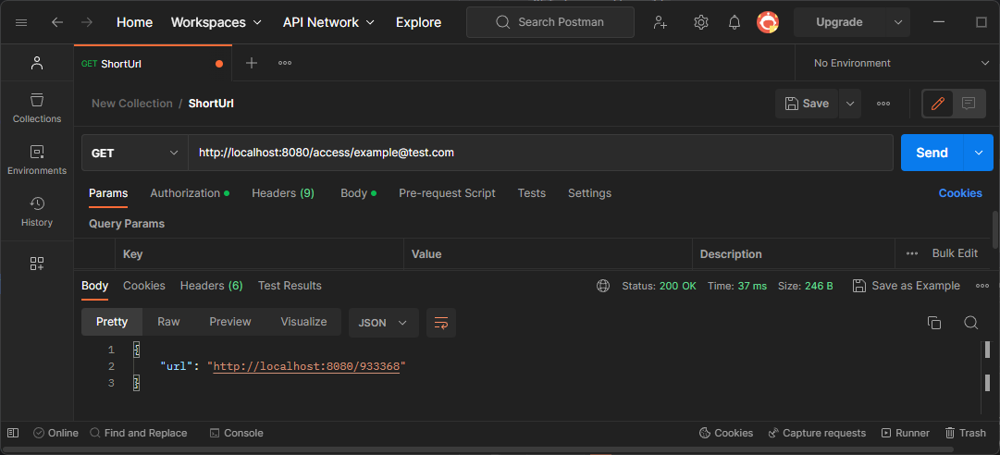
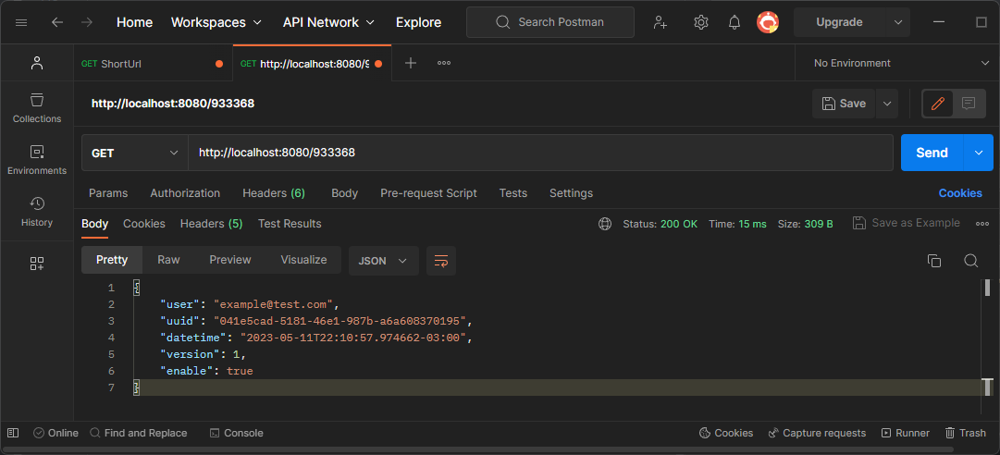
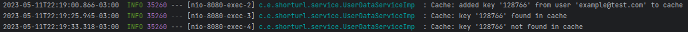

# Challenge - Acortador de URLs

Este proyecto es una aplicación de Spring Boot que implementa una API REST para generar URLs cortas
de alta disponibilidad por un tiempo limitado. Después de ese tiempo, este recurso puede estar
disponible con demoras inherentes al sistema.

## Requisitos

Requiere OpenJDK 20 y una base de datos MySQL.

## Librerías utilizadas

Se utilizaron las siguientes librerías:

- **Lombok**: para simplificar la escritura de código al eliminar la necesidad de escribir ciertas
  partes repetitivas, como getters y setters.
- **GuavaCache**: para la gestión del tiempo de expiración de la caché.
- **MapStruct**: para el mapeo de las entidades a los DTO.
- **Hibernate Validator**: para la validación de los PathVariables en los endpoints.

## Ejecución

Antes de ejecutar la aplicación Java, es necesario asegurarse de que la base de datos MySQL esté
levantada y lista.

### Base de datos

Para crear la base de datos MySQL, se puede utilizar el siguiente comando de Docker:

```bash
docker run --name mysql-short-url -e MYSQL_ROOT_PASSWORD=password1234 -e MYSQL_DATABASE=short_url -p 3306:3306 -d mysql:latest
```

Para detener el contenedor, se puede utilizar el siguiente comando:

```bash
docker stop mysql-short-url
```

Para eliminar el contenedor, se puede utilizar el siguiente comando:

```bash
docker rm mysql-short-url
```

Para iniciar el contenedor nuevamente, se puede utilizar el siguiente comando:

```bash
docker start mysql-short-url
```

### Aplicación Java

Se puede ejecutar la aplicación desde un IDE como IntelliJ.

La aplicación se ejecuta en el puerto **8080**.

## Endpoints

La aplicación cuenta con dos endpoints:

- `GET /access/{email}`: Este endpoint devuelve la URL acortada. Si crea por primera vez el recurso,
  lo almacena en caché por un periodo de tiempo configurado.

Ejemplo de solicitud:

```
GET http://localhost:8080/access/example@test.com
```

Ejemplo de respuesta:

```json
{
  "url": "http://localhost:8080/45612387"
}
```

- `GET /{shortUrl}`: Este endpoint devuelve los datos del usuario. Si accede luego de crear el
  recurso y antes de que se elimine de la caché, la respuesta provendrá de esta caché. En caso
  contrario, deberá buscar el recurso en la base de datos.

Ejemplo de solicitud:

```
GET http://localhost:8080/45612387
```

Ejemplo de respuesta:

```json
{
  "user": "example@test.com",
  "uuid": "ba209999-0c6c-11d2-97cf-00c04f8eea45",
  "datetime": "2021-03-23T16:43:32.010069453-05:00",
  "version": 1,
  "enable": true
}
```

## Implementación

### Controller

La clase `UserDataController` tiene dos métodos GET:

#### `generateShortUrl`

Maneja las solicitudes HTTP que llegan por la URL `/access/{email}`. Espera una dirección de correo
electrónico válida en la URL. Llama al método `generateShortUrl` del servicio `UserDataService` con
el correo electrónico proporcionado y devuelve una respuesta HTTP con el objeto `ShortUrlDto`
generado por el método del service.

Si no se puede generar la URL, se devuelve una respuesta HTTP de error interno del servidor.

#### `getUrlData`

Maneja las solicitudes HTTP que llegan por la URL `/{shortUrl}`. Espera que se proporcione un número
que identifique la URL acortada. Llama al método `getUserData` del servicio `UserDataService` con la
URL corta proporcionada y devuelve una respuesta HTTP con el objeto `UserDataDto` generado por el
método del service.

Si no se puede encontrar la URL corta proporcionada, se devuelve una respuesta HTTP de error "404
Not Found".

### Service

El servicio `UserDataServiceImp` es una clase de la capa de servicio que implementa la
interfaz `UserDataService`. Este servicio es responsable de generar una URL acortada para un usuario
y obtener los datos de usuario asociados con una URL acortada dada.

Este servicio utiliza un repositorio `UserDataRepository` para interactuar con una base de datos
MySQL y un mapeador `UserDataMapper` para mapear entre las entidades y los DTO. También utiliza
un `CacheManager` para almacenar en caché los datos generados para las URL acortadas.

#### `generateShortUrl`

Generar una URL acortada para un usuario dado. Crea un nuevo registro para el usuario con una URL
acortada generada aleatoriamente. Luego, si el registro es nuevo, almacena los
datos de usuario en la caché y devuelve un objeto `ShortUrlDto`, que contiene la URL acortada
generada.

#### `getUserData`

Obtiene los datos de usuario asociados con una URL acortada. Primero verifica si los datos de
usuario están en la caché y, si es así, los devuelve. Si no se encuentran en la caché, busca los
datos de usuario en la base de datos y los devuelve. Retorna un objeto `UserDataDto`, que contiene
los datos de usuario.

### Caché

La clase `CacheConfig` es una clase de configuración de Spring que se encarga de configurar la caché
utilizada en el servicio `UserDataService`. En esta clase se define el tiempo de expiración de la
caché y el tamaño máximo de elementos que se pueden almacenar en ella.

La anotación `@Configuration` indica que esta clase es una clase de configuración de Spring,
mientras que `@EnableCaching` activa la caché en la aplicación.

El método `cacheManager` se encarga de crear una instancia de `ConcurrentMapCacheManager`, una
implementación de `CacheManager` para almacena las cachés en memoria.

El nombre de la caché está definida en la variable `CACHE_NAME_USERS` y el tiempo de expiración en
la variable `CACHE_TIMEOUT_SECS`. Los elementos de la caché se eliminan automáticamente pasado el
tiempo de expiración.

## Pruebas

### Pruebas de los Endpoints

Las pruebas se realizaron utilizando Postman. A continuación, se detallan los request y response de
las pruebas realizadas:

#### `GET /access/{email}`

Request:

```
GET http://localhost:8080/access/example@test.com
```

Response:

```
Status: 200 OK
{
    "url": "http://localhost:8080/933368"
}
```



#### `GET /{shortUrl}`

Request:

```
GET http://localhost:8080/933368
```

Response:

```
Status: 200 OK
{
    "user": "example@test.com",
    "uuid": "041e5cad-5181-46e1-987b-a6a608370195",
    "datetime": "2023-05-11T22:10:57.974662-03:00",
    "version": 1,
    "enable": true
}
```



### Pruebas de la caché



Después de que el usuario realiza la solicitud para generar la URL acortada, la información
correspondiente se almacena en la caché. En la primera solicitud, los datos son accedidos a través
de la caché, ya que todavía no habían expirado. El tiempo de expiración estaba configurado en 30
segundos.

Pasado el tiempo de expiración, los datos ya no se encuentran en la caché, por lo que la aplicación
busca los datos en la base de datos. Esto confirma que la funcionalidad de caché está funcionando
correctamente.

## Autor

Matías Busum Fradera.
